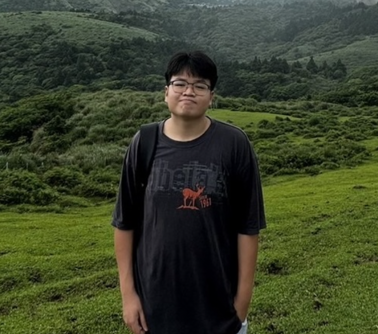

# Board Game
บรรยากาศระหว่างการทำกิจกรรมเล่นบอร์ดเกมของสำนักงานคณะกรรมการการรักษาความมั่นคงปลอดภัยไซเบอร์แห่งชาติ (สกมช. หรือ NCSA)

### กิจกรรมจัดขึ้นในวันจันทร์ที่ 13 มกราคม 2568 ณ โรงอาหารของมหาวิทยาลัยวิทยาเขตศรีราชา

### รายละเอียดของกิจกรรม
กิจกรรมนี้จัดขึ้นโดยกลุ่ม “The Standard” ซึ่งเป็นนิสิตคณะวิทยาศาสตร์ สาขาวิทยาการคอมพิวเตอร์ มหาวิทยาลัยเกษตรศาสตร์ วิทยาเขตศรีราชา
โดยกิจกรรมเป็นการเล่นบอร์ดเกมที่เน้นให้ความรู้เกี่ยวกับการป้องกันทางไซเบอร์ ซึ่งพัฒนาขึ้นโดยสำนักงานคณะกรรมการการรักษาความมั่นคงปลอดภัยไซเบอร์แห่งชาติ (สกมช. หรือ NCSA)

### รูปแบบการเล่นบอร์ดเกม
บอร์ดเกมนี้มีลักษณะคล้ายกับเกมบันไดงู ผู้เล่นจะทอยลูกเต๋าเพื่อเคลื่อนตัวละครไปตามช่องต่าง ๆ บนกระดาน หากตัวละครตกลงในช่อง ‘สีเขียว’ หรือ ‘สีแดง’ กรรมการจะทำการอ่านผลลัพธ์ของช่องนั้น พร้อมอธิบายเนื้อหาเกี่ยวกับการกระทำทางไซเบอร์ว่ามีความถูกต้องเหมาะสมหรือเป็นความเสี่ยงที่ควรหลีกเลี่ยง

### จุดประสงค์ของกิจกรรม
กิจกรรมนี้จัดขึ้นเพื่อเสริมสร้างความตระหนักรู้เกี่ยวกับภัยไซเบอร์ให้แก่นักเรียน นักศึกษา และประชาชนทั่วไป โดยเน้นให้ผู้เข้าร่วมกิจกรรมได้เรียนรู้เกี่ยวกับการป้องกันและรับมือกับความเสี่ยงทางไซเบอร์ผ่านการเล่นบอร์ดเกมในรูปแบบที่สนุกสนานและเข้าใจง่าย

### ผู้เข้าร่วมกิจกรรม
กลุ่มผู้เล่นที่เข้าร่วมกิจกรรมบอร์ดเกมในครั้งนี้ ได้แก่
- นิสิตคณะวิทยาศาสตร์ สาขาวิทยาการคอมพิวเตอร์ ชั้นปีที่ 2 จำนวน 3 คน
- สมาชิกกลุ่ม “The Standard” จำนวน 2 คน

### บรรยากาศการเล่นกิจกรรมดังกล่าว 
#### รูปภาพ

#### คลิปวิดีโอ > https://youtu.be/tMAkRKSooh4

### สมาชิกกลุ่ม
- [Supakrit Somritjinda](https://jekoflash.github.io/boardGame)
- [Klittima Chaowadee](https://anniemark2522.github.io/boardgame/boardg)
- [Nakorn Tungprapaporn](https://taedate.github.io/boardgame)
- [Natchanan Lordee](https://ncnld2547.github.io/boardgameActivity)
- [Veeraya Lekchaoum](https://valin4637.github.io/boardGame)