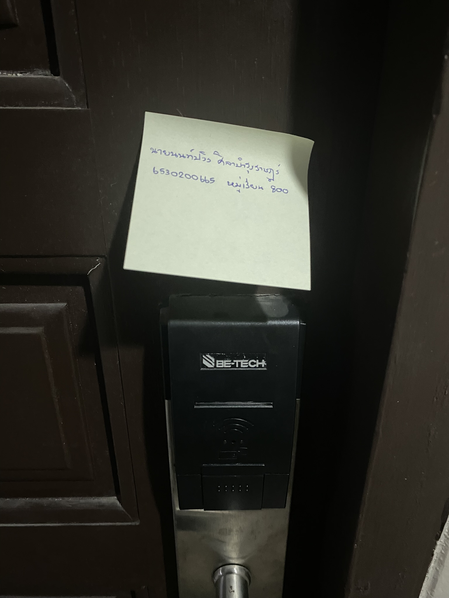

# Security Controls in Daily Life
By Nonpawit Silabumrungrad 6530200665 SEC 800

# Digital Door Lock 
#### at Baansuksabuy Apartment

#### Type of Security Controls
> Digital Door Lock เป็น Physical Control เนื่องจากช่วยป้องกันการเข้าถึงพื้นที่โดยไม่ได้รับอนุญาต ผ่านการควบคุมการเปิดประตูด้วยอุปกรณ์ทางกายภาพ เช่น Keycard, รหัสผ่าน หรือระบบสแกนลายนิ้วมือ ซึ่งช่วยเพิ่มความปลอดภัยในการควบคุมการเข้า-ออกของบุคคลได้อย่างมีประสิทธิภาพ

#### Control Functions
> Digital Door Lock เป็น Preventative Control เนื่องจากช่วยป้องกันไม่ให้บุคคลที่ไม่ได้รับอนุญาตเข้าถึงพื้นที่ได้ โดยต้องใช้ Keycard หรือรหัสผ่านในการปลดล็อก ซึ่งช่วยลดความเสี่ยงจากการบุกรุกหรือการเข้าถึงโดยไม่ได้รับอนุญาตอย่างมีประสิทธิภาพ
